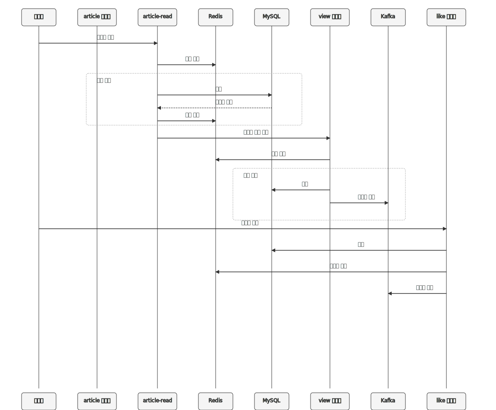

# 인프런 - 스프링부트로 직접 만들면서 배우는 대규모 시스템 설계 - 게시판
# KUKE-Board 프로젝트 구조 및 동작 원리

## 목차
1. [개요](#개요)
2. [프로젝트 구조](#프로젝트-구조)
3. [기술 스택](#기술-스택)
4. [Common 모듈](#common-모듈)
5. [Service 모듈](#service-모듈)
6. [인프라 구성요소](#인프라-구성요소)
7. [데이터 흐름도](#데이터-흐름도)
8. [상세 프로세스 설명](#상세-프로세스-설명)

## 개요

KUKE-Board는 마이크로서비스 아키텍처(MSA)를 기반으로 구축된 게시판 시스템입니다. 이 시스템은 여러 독립적인 서비스로 구성되어 있으며, MySQL, Kafka, Redis를 함께 활용하여 효율적인 데이터 처리와 서비스 간 통신을 구현합니다. 이 문서에서는 특히 `common` 폴더와 `service` 폴더에 있는 모듈들의 관계와 인프라 구성요소와의 상호작용을 쉽게 설명합니다.

## 프로젝트 구조

프로젝트는 크게 두 가지 주요 폴더로 구성됩니다:

```
kuke-board/
├── common/                 # 공통 기능 모듈
│   ├── event               # 이벤트 정의 및 처리
│   ├── snowflake           # 분산 ID 생성기
│   ├── data-serializer     # 데이터 직렬화/역직렬화
│   └── outbox-message-relay # 트랜잭션 안정성 보장
└── service/                # 개별 서비스 모듈
    ├── article             # 게시글 관리
    ├── comment             # 댓글 관리
    ├── like                # 좋아요 기능
    ├── view                # 조회수 관리
    ├── hot-article         # 인기 게시글 처리
    └── article-read        # 게시글 조회 최적화
```

## 실행 순서
 - ArticleApplication
 - CommentApplication
 - LikeApplication
 - ViewApplication
 - ArticleReadApplication
 - HotArticleApplication

## 기술 스택

KUKE-Board는 다음과 같은 주요 기술을 사용합니다:

1. **Jakarta EE**: 자바 기반 엔터프라이즈 어플리케이션 개발 표준
2. **Spring Data JPA**: 데이터 접근 계층 단순화
3. **Spring MVC**: 웹 계층 처리
4. **Lombok**: 코드 간소화 유틸리티
5. **Java 21**: 최신 자바 기능 활용

### 인프라 구성요소
- **MySQL**: 영구 데이터 저장소
- **Kafka**: 이벤트 기반 통신 메시지 브로커
- **Redis**: 캐싱 및 일시적 데이터 저장

## Common 모듈

Common 폴더는 여러 서비스에서 공통적으로 사용하는 기능들을 모아놓은 곳입니다. 각 모듈의 역할은 다음과 같습니다:

### 1. event
- **역할**: 서비스 간 통신을 위한 이벤트 구조 정의
- **주요 기능**: 이벤트 메시지 형식 정의, 이벤트 처리 인터페이스 제공
- **관련 인프라**: Kafka와 직접 연동하여 이벤트 발행 및 구독 처리

### 2. snowflake
- **역할**: 분산 환경에서 고유 ID 생성
- **주요 기능**: 시간 기반 고유 ID 생성 알고리즘 제공
- **핵심 가치**: 분산 환경에서도 중복 없는 ID 생성 보장

### 3. data-serializer
- **역할**: 데이터 직렬화/역직렬화 기능
- **주요 기능**: JSON 변환, 객체 직렬화 지원
- **관련 인프라**: Kafka 메시지 및 Redis 캐시 데이터 형식 변환

### 4. outbox-message-relay
- **역할**: 이벤트 발행의 안정성 보장
- **주요 기능**: 데이터베이스 트랜잭션과 이벤트 발행을 원자적으로 처리
- **관련 인프라**: MySQL과 Kafka 간의 일관성 보장
- **작동 방식**:
    - 데이터 변경 시 MySQL 트랜잭션과 함께 outbox 테이블에 메시지 저장
    - 별도 프로세스가 주기적으로 outbox 테이블에서 미발행 메시지를 읽어 Kafka로 발행
    - 메시지 발행 성공 시 outbox 테이블에서 상태 업데이트

## Service 모듈

Service 폴더는 각각 독립적인 기능을 담당하는 마이크로서비스들로 구성됩니다:

### 1. article
- **역할**: 게시글 CRUD 처리
- **주요 기능**: 게시글 작성, 수정, 삭제, 조회
- **데이터베이스**: MySQL(게시글 영구 저장)
- **캐시**: Redis(자주 조회되는 게시글 캐싱)
- **이벤트 발행**: 게시글 생성/수정/삭제 시 Kafka 이벤트 발행

### 2. comment
- **역할**: 댓글 기능 제공
- **주요 기능**: 댓글 작성, 수정, 삭제, 조회
- **데이터베이스**: MySQL(댓글 영구 저장)
- **캐시**: Redis(댓글 목록 캐싱)
- **이벤트 발행**: 댓글 관련 이벤트 발행

### 3. like
- **역할**: 게시글/댓글 좋아요 기능
- **주요 기능**: 좋아요 추가/취소, 좋아요 개수 집계
- **데이터베이스**: MySQL(좋아요 데이터 영구 저장)
- **캐시**: Redis(실시간 좋아요 카운트 관리)
- **이벤트 발행**: 좋아요 상태 변경 이벤트 발행

### 4. view
- **역할**: 게시글 조회수 관리
- **주요 기능**: 조회수 증가, 조회수 통계
- **데이터베이스**: MySQL(조회수 통계 저장)
- **캐시**: Redis(중복 조회 방지 및 실시간 조회수 관리)
- **이벤트 발행**: 조회수 변경 이벤트 발행

### 5. hot-article
- **역할**: 인기 게시글 선정
- **주요 기능**: 조회수, 좋아요 기반 인기 게시글 계산
- **데이터베이스**: MySQL(인기 게시글 목록 저장)
- **메시지 구독**: 좋아요, 조회수 이벤트 구독하여 인기도 계산
- **캐시**: Redis(인기 게시글 목록 캐싱)

### 6. article-read
- **역할**: 게시글 조회 전용 서비스
- **주요 기능**: 최적화된 게시글 읽기 기능 제공
- **데이터베이스**: MySQL(읽기 전용 최적화 쿼리)
- **캐시**: Redis(자주 조회되는 게시글 및 통계 데이터 캐싱)
- **메시지 구독**: 게시글, 조회수, 좋아요 이벤트 구독하여 데이터 최신화

## 인프라 구성요소

### MySQL
- **역할**: 영구 데이터 저장소
- **사용 영역**:
    - 각 서비스별 고유 데이터 저장
    - 트랜잭션 관리
    - Outbox 패턴을 위한 메시지 임시 저장

### Kafka
- **역할**: 이벤트 중심 서비스 간 통신
- **사용 영역**:
    - 서비스 간 이벤트 발행/구독
    - 데이터 변경사항 실시간 전파
    - 시스템 확장성 및 장애 내구성 제공

### Redis
- **역할**: 고성능 캐싱 및 임시 데이터 저장
- **사용 영역**:
    - 자주 조회되는 데이터 캐싱
    - 실시간 카운터(조회수, 좋아요 수) 관리
    - 세션 데이터 관리
    - 중복 요청 방지(조회수 중복 방지 등)

## 데이터 흐름도

아래는 주요 프로세스의 데이터 흐름과 인프라 구성요소의 상호작용을 보여주는 다이어그램입니다:


## 상세 프로세스 설명

### 게시글 작성 및 전파 프로세스

1. 사용자가 게시글을 작성하면 `article` 서비스에서 처리합니다.
2. `article` 서비스는 `snowflake` 모듈을 사용하여 고유 ID를 생성합니다.
3. 게시글 데이터는 MySQL에 저장됩니다.
4. 동시에 `outbox-message-relay` 모듈을 통해 MySQL의 outbox 테이블에 이벤트를 저장합니다.
5. `outbox-message-relay`는 별도 스케줄러를 통해 outbox 테이블의 미발행 메시지를 확인하고 Kafka로 발행합니다.
6. 메시지는 `data-serializer`를 통해 직렬화되어 Kafka로 전송됩니다.
7. `article-read`, `hot-article` 등의 서비스는 Kafka에서 이벤트를 구독하여 자신의 데이터를 업데이트합니다.
8. `article-read` 서비스는 자주 조회되는 게시글을 Redis에 캐싱하여 빠른 응답 시간을 제공합니다.

### 좋아요 처리 프로세스

1. 사용자가 게시글에 좋아요를 누르면 `like` 서비스에서 처리합니다.
2. 좋아요 정보는 MySQL에 저장됩니다.
3. 동시에 Redis에 실시간 좋아요 카운트를 증가시킵니다.
4. `outbox-message-relay`를 통해 좋아요 이벤트가 Kafka로 발행됩니다.
5. `hot-article` 서비스는 이 이벤트를 구독하여 Redis에서 인기 게시글 점수를 갱신합니다.
6. `article-read` 서비스는 좋아요 이벤트를 구독하여 캐시된 게시글 정보를 업데이트합니다.

### 조회수 처리 프로세스

1. 사용자가 게시글을 조회하면 `article-read` 서비스에서 게시글 정보를 제공합니다.
    - 먼저 Redis 캐시를 확인하고, 없으면 MySQL에서 조회합니다.
2. 동시에 `view` 서비스에 조회수 증가 요청을 보냅니다.
3. `view` 서비스는 Redis를 사용하여 사용자별 중복 조회를 체크합니다.
4. 중복이 아닌 경우 조회수를 증가시키고 MySQL에 기록합니다.
5. 조회수 증가 이벤트는 Kafka를 통해 발행되며, `hot-article` 서비스가 이를 구독하여 인기도 점수를 업데이트합니다.

### 인기 게시글 계산 프로세스

1. `hot-article` 서비스는 Kafka에서 좋아요, 조회수, 댓글 이벤트를 구독합니다.
2. 이벤트 발생 시 Redis에 저장된 게시글 점수를 실시간으로 업데이트합니다.
3. 정기적으로 고점수 게시글을 선별하여 인기 게시글 목록을 MySQL에 저장합니다.
4. 인기 게시글 목록은 다시 Redis에 캐싱되어 빠른 조회가 가능합니다.

이 구조의 핵심 장점은 다음과 같습니다:

1. **확장성**: 각 서비스가 독립적으로 확장 가능합니다.
2. **장애 격리**: 한 서비스의 문제가 전체 시스템에 영향을 미치지 않습니다.
3. **데이터 일관성**: `outbox-message-relay`를 통해 데이터베이스 트랜잭션과 이벤트 발행의 일관성을 보장합니다.
4. **성능 최적화**: Redis를 활용한 캐싱으로 자주 조회되는 데이터의 응답 시간을 최소화합니다.
5. **실시간성**: Kafka를 통한 이벤트 기반 통신으로 데이터 변경사항이 실시간으로 전파됩니다.

